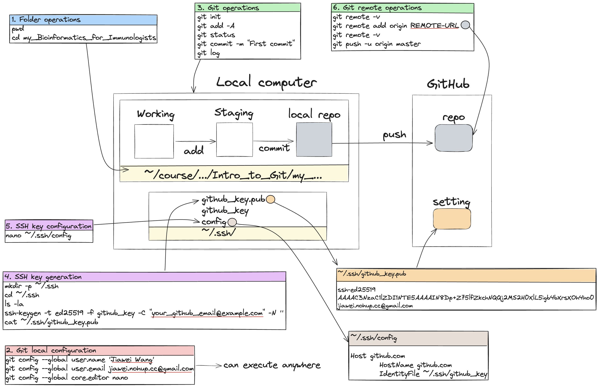

```{r setup, include=FALSE}
knitr::opts_chunk$set(echo = TRUE)
```



## Overview

Most of the materials originate from [Walter Santana' Git and GitHub tutorial](https://github.com/santanaw/primers4predoc-git?tab=readme-ov-file) and [GitHub Docs](https://docs.github.com/en/authentication/connecting-to-github-with-ssh) with some of the text copied with a few edits. In this tutorial, we will explore the basics of using Git and GitHub.

### Local configuration

Set local user information (username and email) for Git in your VM. The term "local" is used in contrast to "remote" on GitHub. This information will be used across all Git repositories in this VM or computer.

```         
git config --global user.name 'Jiawei Wang'
git config --global user.email jiawei.nohup.cc@gmail.com
git config --global core.editor nano
```

### Create a local repository

Initialize the local directory as a Git repository. By default, the initial branch is called `master` (or main):

```         
# mkdir my_Bioinformatics_for_Immunologists
cd my_Bioinformatics_for_Immunologists
ls -l
git init
```

Now try to copy one folder under the current folder:

```         
cp -r ../../Bioinformatics_for_Immunologists/Intro_to_UNIX_and_bash_shell ./
ls
```

Add the files in your new local repository. This stages them for the first commit:

```         
git add -A # or git add Intro_to_UNIX_and_bash_shell
```

This adds the files in the local repository and stages them for commit. To unstage a file, use 'git reset HEAD YOUR-FILE'.

Check the status:

```         
git status
```

Commit the files that you've staged in your local repository:

```         
git commit -m "First commit"
```

Commits the tracked changes and prepares them to be pushed to a remote repository. To remove this commit and modify the file, use 'git reset --soft HEAD\~1' and commit and add the file again.

You can now check the log of the commit history:

```         
git log # Press 'q' to quit the log page 
```

### Adding a local repository to GitHub using Git

Before you can add your local repository to GitHub using Git, you must authenticate to GitHub on the command line.

You can access repositories on GitHub from the command line in two ways, HTTPS and SSH, and both have a different way of authenticating. Here, we will teach you how to authenticate using SSH without GitHub CLI.

When you authenticate without GitHub CLI, you will need to generate an SSH public/private keypair on your local machine and add the public key to your account on GitHub.com. Every time you use Git to authenticate with GitHub, you'll be prompted to enter your SSH key passphrase, unless you've [stored the key](https://docs.github.com/en/authentication/connecting-to-github-with-ssh/generating-a-new-ssh-key-and-adding-it-to-the-ssh-agent#adding-your-ssh-key-to-the-ssh-agent).

#### Generating a new SSH key

You can generate a new SSH key on your local machine. After you generate the key, you can add the public key to your account on GitHub.com to enable authentication for Git operations over SSH.

1.  Open the terminal and run:

    ```         
    mkdir -p ~/.ssh
    cd ~/.ssh

    # generate an ssh key using the "ssh-keygen" command
    # "ed25519" can be any strings that you want to identify the ssh key
    # "your_github_email@example.com" has to be replaced with your own email
    ssh-keygen -t ed25519 -f github_key -C "your_github_email@example.com" -N ''

    # this gives you the ssh key content that you will need to copy and paste into the following section
    cat ~/.ssh/github_key.pub
    ```

    Please note that you need to generate a key in each working machine that will be used for pushing code to GitHub.

#### Adding the local key to GitHub

1.  Select and copy the last command's output (i.e. SSH key)
2.  Open a browser and then go to [GitHub SSH keys](https://github.com/settings/keys). Click 'New SSH key'
3.  Enter a name (which can be any string you like) for the new SSH key that will be added and select "Authentication Key" from the dropdown menu.
4.  Paste the SSH key from the last command's output in the above section(you should have done this in step 1 of this section) into the "Key" field

#### Setting up the GitHub configuration file locally

1.  Return to the VM's Terminal and open or create a `config` file in the `~/.ssh/` directory.

    ```         
    nano ~/.ssh/config
    ```

    This command will open the file "\~/.ssh/config" if it has already existed and otherwise create a new file "\~/.ssh/config".

2.  Check the content of the file "\~/.ssh/config" (which can be empty) and copy and paste the following content into the file "\~/.ssh/config" if it doesn't contain exactly the same content.

    ```         
    Host github.com
        HostName github.com
        IdentityFile ~/.ssh/github_key
    ```

    The `config` file allows you to specify which SSH key (this case we specify the GitHub ssh key "\~/.ssh/github_key") to use when this computer connects to a remote server/host (in this case the host is github.com). It becomes even more useful when multiple SSH keys are stored in the `~/.ssh/` directory to interact with different machines.

#### Connect the local repository to the remote GitHub repository

Now you have successfully generated a key and add it to your Github. We can start adding our local repository to GitHub.

1.  Create a new repository on GitHub.com. To avoid errors, do not initialize the new repository with README, license, or gitignore files. You can add these files after your project has been pushed to GitHub.

2.  At the top of your repository on GitHub.com's Quick Setup page, copy the remote repository URL.

3.  Open Terminal.

4.  Change the current working directory to your local project.

5.  To add the URL for the remote repository where your local repository will be pushed, run the following command. Replace `REMOTE-URL` with the repository's full URL on GitHub.

    ```         
    git remote add origin REMOTE-URL
    ```

6.  To verify that you set the remote URL correctly, run the following command.

    ```         
    git remote -v
    ```

#### Push the local repository to the remote GitHub repository

1.  Check the name of your branch first; it can be either "master" in linux systems or "main" in mac systems:

    ```         
    git branch
    ```

2.  To push the changes in your local repository to GitHub.com, run the following command.

    ```         
    git push -u origin master
    ```

### Keep the repository up to date

Now you have successfully made a change to your remote repository. Consider the following scenario: another person is also working on the same repository locally, unaware of the changes you have just made to the remote repository. For this person to get the newest content you have just pushed, they should use the `git pull` command to get the latest content from the remote repository.

To simulate the work environment of the other person, we can create a new empty folder:

```         
# go to a location outside of your previous local repository
# here we use "~/Downloads" as an example, but you can change it to any folder 
cd ~/Downloads
mkdir my_Bioinformatics_for_Immunologists_0
cd my_Bioinformatics_for_Immunologists_0/
```

Now, we can initialize the folder (`my_Bioinformatics_for_Immunologists_0`) as a local repository and add the remote URL:

```         
git init
git remote add origin REMOTE-URL
```

To get the latest content, all we have to do is the following:

```         
# again, before you do this, check the name of your branch first using "git branch"
git branch
# it can be either "master" or "main"
git pull origin master
```

Now we have everything up to date.

### Remove files on Github

Now you might want to remove your uploaded file. Lets now remove the previously uploaded folder.

```         
git rm -r Intro_to_UNIX_and_bash_shell/
```

Now check the status:

```         
git status
```

We can now commit the changes and push them:

```         
git commit -m "Delete Intro_to_UNIX_and_bash_shell/"
```

```         
git push 
```

Now you can see the folder `Intro_to_UNIX_and_bash_shell` is deleted on Github.

Alternatively you can replace `git rm -r` by two steps to achieve the same outcome:

```         
rm <file>
git add <file>
```

### Branches

In Git, a branch is a new/separate version of the main repository. Go back to our example:

```         
git branch
```

We can see that we only have one branch.

Let’s create a new branch `new`.

```         
git branch new
```

Now we have two branches:

```         
git branch
```

Now to switch to `new` using `git checkout new`

```         
git checkout new 
```

Now let's make a new commit on `new` branch.

```         
cp -r ../../Bioinformatics_for_Immunologists/Intro_to_R ./
git add -A
git commit -m "new branch first commit"
git push -u origin new
```

We can now see the folder appeared in the `new` branch, where nothing else happened for the `master` branch as expected. We can also see the new commit in the log.

```         
git log
```

At some points you might want to merge the content of two branches. Suppose we want to merge the `new` branch into the `master` branch. To do this, we first need to go to `master` branch:

```         
git checkout master

# check the name of your branch first; it can be either "master" or "main"
```

then start merging:

```         
git merge new
git commit -m "first merge master and new"
git push origin master

# check the name of your branch first; it can be either "master" or "main"
```

We can now see the file appearing in `master` branch.

### Branch merging with conflict

Now suppose we change the first row of `my_Bioinformatics_for_Immunologists/Intro_to_R/my_example.csv` to "first row (master)".

```         
git add -A
git commit -m "change first row in my_example.csv (master)"
git push origin master

# check the name of your branch first; it can be either "master" or "main"
```

Now lets merge `master` into `new` branch.

```         
git checkout new
```

first change the first row of `my_Bioinformatics_for_Immunologists/Intro_to_R/my_example.csv` to "first row (new)".

```         
git add -A
git commit -m "change first row in my_example.csv (new)"
git push origin new
```

Now we can try to merge:

```         
git merge master

# check the name of your branch first; it can be either "master" or "main"
```

We will see the following error:

```         
Auto-merging Intro_to_R/my_example.csv
CONFLICT (content): Merge conflict in Intro_to_R/my_example.csv
Automatic merge failed; fix conflicts and then commit the result.
```

We can check out the conflict:

```         
git diff
```

```         
diff --cc Intro_to_R/my_example.csv
index 4fdbd18,c23c710..0000000
--- a/Intro_to_R/my_example.csv
+++ b/Intro_to_R/my_example.csv
@@@ -1,4 -1,4 +1,8 @@@
++<<<<<<< HEAD
 +first row (new)
++=======
+ first row (master)
++>>>>>>> master
```

To resolve the change we can go to the target file `Intro_to_R/my_example.csv`.

```         
# <<<<<<< HEAD
# first row (new)
# =======
# first row (master)
# >>>>>>> master
# 2000,Electronics,High-End,10210,2550,755
# ...
```

make modifications to the file and retain the desired version.

```         
first row (new)
2000,Electronics,High-End,10210,2550,755
...
```

After resolving the changes, we now make another commit:

```         
git add -A
git commit -m "change first row in my_example.csv (resolve conflict)"
git push origin master
```

Alternatively, you can abort merge:

```         
git merge --abort
```

Having done everything we wanted with `new` branch, we now need to delete it:

```         
git checkout master
git branch -d new
# git branch -D new
```

## Exercise

As an exercise, you can upload everything we have covered to your own GitHub repository.
